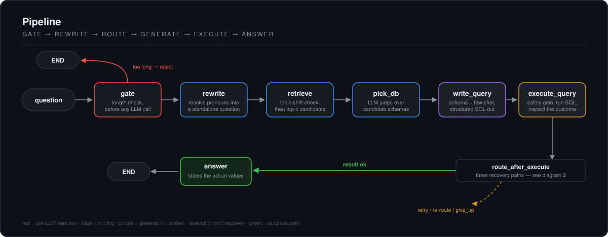
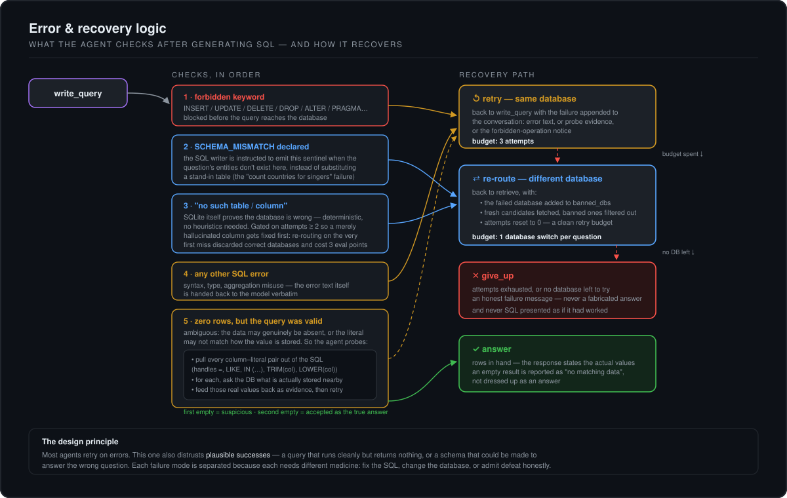
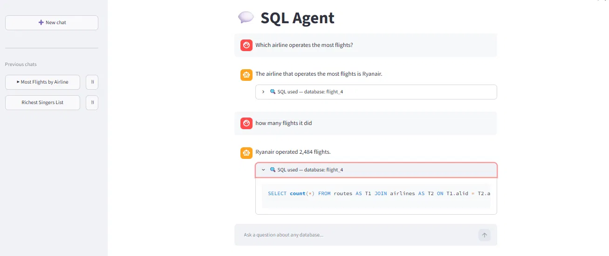
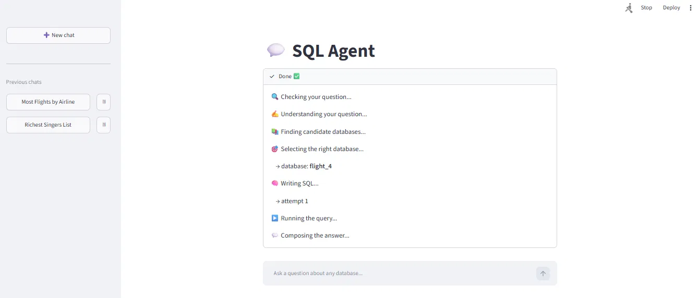

# 🕸️ Text-to-SQL Agent

**Ask questions in plain English. Get answers from the right database — out of 166 of them.**

A LangGraph agent that routes natural-language questions across the full [Spider](https://yale-lily.github.io/spider) benchmark's databases, writes SQLite queries, executes them safely, and — when something looks wrong — *investigates* before retrying: probing the data for what's actually stored, or abandoning a database that provably can't answer the question.


---

## 📊 Measured Results (Spider dev set, n = 100)

| Stage | Accuracy |
|---|---|
| **Database routing** (two-stage: embedding top-5 → LLM disambiguation) | **81%** |
| **End-to-end execution accuracy** (right answer from the right data) | **70%** |

Routing failures decompose into two very different diseases: **12% judge errors**
(dominated by near-twin databases like `flight_2` vs `flight_4` — both of which
can legitimately answer the same flight question) and a **7% retrieval ceiling**
(the correct database never reached the top-5, largely on questions whose
vocabulary is inherently ambiguous — *"find the total number of players"* is
gold-labelled women's tennis).

Separating those two numbers is what made the next fixes obvious: enriching
profiles helps the ceiling, sharper judging helps the twins, and neither helps
the other.

---

## 🧠 Architecture



### Error handling & recovery



### The pipeline

1. **Gate** — questions over a length limit are rejected *before any LLM call*, so abuse costs nothing.
2. **Rewrite** — follow-ups (*"how many flights does each of **them** operate?"*) are rewritten into standalone questions from conversation history, so routing and SQL generation never see dangling pronouns. A rewrite that comes back empty or oversized is distrusted and discarded.
3. **Retrieve** — the question is embedded and matched against LLM-generated *database profiles* (domain, contents, example questions per DB) in ChromaDB. Mid-conversation, a cheap LLM classifier first decides **FOLLOWUP vs NEW subject**: follow-ups stay on the current database (and skip the expensive judge call), new subjects trigger a full re-route.
4. **Disambiguate** — an LLM judge picks the right database from the candidates' full schemas. Skipped entirely when only one candidate survives.
5. **Write SQL** — gpt-4o-mini with structured output (Pydantic), the live schema, and similar solved examples retrieved from a 7,000-pair question→SQL bank.
6. **Execute** — behind a safety gate (SELECT-only, forbidden-keyword block, result truncation).
7. **Recover** — three distinct paths depending on *what kind* of wrong happened: retry on the same database, switch databases, or fail honestly.

---

## 💬 In use



A follow-up like *"how many flights it did"* needs no repetition — the agent
resolves the reference against the conversation, recognises it as the same
subject, and stays on the database it already selected.

Every step is visible while it runs, so a wrong answer is traceable to the
node that produced it:



---

## 🔎 Two things this agent distrusts

Most text-to-SQL agents retry when SQL *errors*. This one also distrusts outcomes that look fine but aren't.

### 1. A query that succeeds but returns nothing

Zero rows is ambiguous — the data may genuinely be absent, or the literal may not match how the value is stored. So the agent extracts every column–literal pair from its own SQL (handling `=`, `LIKE`, `IN (…)`, and function-wrapped columns like `TRIM(col)`), probes the database for what's actually stored near each value, and feeds back **facts**:

```
Your query returned ZERO rows. I checked the database for the values you filtered on:
- You filtered City = 'Aberdeen'. Matching stored values in airports.City:
  [('Aberdeen, MD',)]
Rewrite the query using the ACTUAL stored values or the correct column.
```

The first empty result is suspicious; a second one is accepted as the true answer, so the agent never loops on legitimately empty data.

**Why this exists:** during evaluation a perfectly correct query kept returning nothing. Spider's `flight_2` stores airport codes with a **leading space** (`' APG'`, not `'APG'`) — dirty data that defeats even the benchmark's own gold queries. Literal string matching is the #1 real-world text-to-SQL failure mode; this handles it structurally instead of hoping.

### 2. A database that can't actually answer the question

Routing is 81% accurate, which means roughly one question in five starts on the wrong database — and a capable model will happily produce *plausible* SQL against the wrong schema (counting countries when asked about singers). Two independent detectors catch this:

- **Declared** — the SQL writer is instructed to emit a `SCHEMA_MISMATCH` sentinel when the question's entities don't exist in the schema, rather than substituting a stand-in table.
- **Proven** — a `no such table` / `no such column` error is SQLite itself confirming the database is wrong. No heuristics required.

Either triggers a **re-route**: the failed database is added to `banned_dbs`, fresh candidates are fetched without it, and the retry budget resets. One database switch is allowed per question.

> The proven-wrong detector is deliberately gated on `attempts >= 2`. Re-routing on the *first* missing-column error discards correct databases over recoverable hallucinated column names — measured at **3 points of end-to-end accuracy**.

---

## 🛡️ Production-minded details

- **Input gate** — oversized questions rejected pre-LLM
- **Safety gate** — SELECT-only enforcement before any query reaches a database
- **Token-budget controls** — results truncated before entering prompts, message history windowed in long chats, single-candidate routing skips a redundant LLM call
- **Bounded recovery** — 3 SQL attempts, 1 database switch; every loop has a budget
- **Honest failure** — no fabricated answers, no SQL presented as though it worked
- **Observability** — full Langfuse tracing on every node and LLM call
- **Two graphs, one workflow** — a memory-free graph for reproducible evals, a SQLite-checkpointed graph for the multi-turn chat app

---

## 🗂️ Repository map

```
src/        agent.py            LangGraph nodes, recovery logic, both compiled graphs
            routing.py          two-stage routing (vector top-5 + LLM judge)
            vectorstore.py      ChromaDB collections: database profiles + example bank
            config.py           dataset paths, model + token knobs
scripts/    ingest_db_docs.py   generates & embeds an LLM-written profile per database
            ingest_examples.py  embeds 7,000 Spider question->SQL pairs for few-shot retrieval
eval/       eval_routing.py     routing accuracy harness
            eval_end_to_end.py  execution-accuracy harness
            smoke_test.py       regression cases, each labelled with the bug it guards
docs/       architecture diagrams
app.py      Streamlit chat frontend (multi-turn, checkpointed)
```

---

## 🚀 Setup

```bash
git clone https://github.com/deku-3/SQL_agent.git
cd SQL_agent
pip install -r requirements.txt
```

1. Download the [Spider dataset](https://yale-lily.github.io/spider) and point `src/config.py` at it.
2. Create `.env` (see `.env.example`):
   ```
   OPENAI_API_KEY=sk-...
   LANGFUSE_PUBLIC_KEY=...      # optional, for tracing
   LANGFUSE_SECRET_KEY=...
   ```
3. Build the retrieval layer (one-time, a few cents of API cost):
   ```bash
   python -m scripts.ingest_db_docs     # LLM-written profile per database
   python -m scripts.ingest_examples    # 7,000-example few-shot bank
   ```
4. Ask questions:
   ```bash
   python -m eval.smoke_test    # regression cases in the console
   streamlit run app.py         # chat UI
   ```

---

## 🧭 Roadmap

- [ ] Failure-bucket analysis of the 30% end-to-end misses
- [ ] Hybrid retrieval (BM25 + vectors) to attack the 7% routing ceiling — exact codes and rare tokens are where embeddings are weakest
- [ ] Value grounding *before* generation, not just after an empty result
- [ ] Cache-aligned prompting (static schema prefix first → cheaper multi-turn chats)
- [ ] FastAPI + Docker deployment; MCP server wrapper so other agents can use this as a tool

---

## 📝 Lessons learned the hard way

- **Dirty data beats correct SQL.** A single leading space defeated both my agent and Spider's own gold queries. Value grounding > literal matching.
- **Decompose the error before fixing anything.** Routing misses and generation misses need different medicine; measuring them separately (81% vs 70%) showed exactly where accuracy leaks — and one "obvious" improvement (re-route immediately on a missing column) turned out to *cost* 3 points.
- **A plausible answer from the wrong database is worse than an error.** Hence the `SCHEMA_MISMATCH` escape hatch: making the model able to say "not here" beat making it try harder.
- **Silent process death with no traceback means the problem is below Python.** This project also survived a broken system `MSVCP140.dll` that crashed every vector-store write on the machine. Event Viewer found it; print statements never would have.

---

*Built as a deep-dive into RAG, agent architecture, and evaluation discipline. Questions and issues welcome.*
