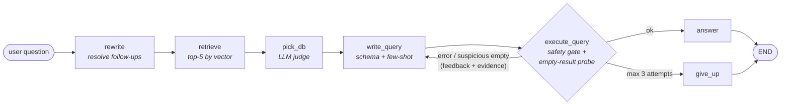
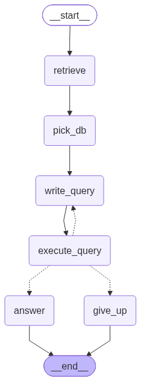

# 🕸️ Text-to-SQL Agent

**Ask questions in plain English. Get answers from the right database — out of 166 of them.**

A LangGraph agent that routes natural-language questions across the full [Spider](https://yale-lily.github.io/spider) benchmark's databases, writes SQLite queries, executes them safely, and — when a query comes back empty — *investigates the actual data* before retrying.


---

## 📊 Measured Results (Spider dev set, n = 100)

| Stage | Accuracy |
|---|---|
| **Database routing** (two-stage: embedding top-5 → LLM disambiguation) | **81%** |
| **End-to-end execution accuracy** (right answer from the right data) | **70%** |

Failure decomposition of routing errors: 12% judge errors (dominated by near-twin
databases like `flight_2` vs `flight_4` that can both answer the same question),
7% retrieval ceiling (gold DB never reached top-5 — largely questions whose
vocabulary is inherently ambiguous, e.g. *"find the total number of players"*
→ women's tennis).

> Every number here is reproducible: the eval harness lives in `test.py`.

---

## 🧠 Architecture




### The pipeline

1. **Rewrite** — follow-up questions (*"how many flights does each of **them** operate?"*) are rewritten into standalone questions using conversation history, so routing and SQL generation never see dangling pronouns.
2. **Route** — the question is embedded and matched against LLM-generated *database profiles* (domain, contents, example questions per DB) in ChromaDB → top-5 candidates.
3. **Disambiguate** — an LLM judge picks the right database from the candidates' full schemas.
4. **Write SQL** — gpt-4o-mini with structured output (Pydantic), the live schema, and similar solved examples retrieved from a 7,000-pair question→SQL bank.
5. **Execute** — behind a safety gate (SELECT-only, forbidden-keyword block, result truncation).
6. **Self-correct** — errors feed back verbatim for up to 3 attempts.

---

## 🔎 The interesting part: evidence-based retry

Most text-to-SQL agents retry on *errors*. This one also investigates *suspicious successes* — a query that runs fine but returns **zero rows** when it filtered on string literals.

Instead of guessing, the agent probes the database for what is *actually stored* near each filtered value and feeds back **facts**:

```
Your query returned ZERO rows. I checked the database for the values you filtered on:
- You filtered City = 'Aberdeen'. Matching stored values in airports.City:
  [('Aberdeen, MD',)]
Rewrite the query using the ACTUAL stored values or the correct column.
```

**Why this exists:** during evaluation, a perfectly correct query kept returning
empty. Investigation revealed Spider's `flight_2` stores airport codes with a
leading space (`' APG'`, not `'APG'`) — dirty data that defeats even the
benchmark's own gold queries. Literal string matching is the #1 real-world
text-to-SQL failure mode; this agent handles it structurally.

---

## 🛡️ Production-minded details

- **Safety gate** — SELECT-only enforcement before any query touches a database
- **Token-budget controls** — query results truncated before entering prompts; message history windowed in long chats; sticky routing skips redundant disambiguation calls on follow-ups
- **Honest empties** — an empty result is treated as suspicious *once*, then accepted as the true answer (no infinite self-doubt loops)
- **Two graphs, one workflow** — a memory-free graph for reproducible evals, a SQLite-checkpointed graph for the multi-turn chat app (`app.py`, Streamlit)

---

## 🗂️ Repository map

| File | What it does |
|---|---|
| `sql_ag.py` | The agent: LangGraph nodes, evidence-based retry, both compiled graphs |
| `disambiguate.py` | Two-stage routing (vector top-5 + LLM judge) |
| `vectorstore.py` | ChromaDB collections: database profiles + example bank |
| `ingest_db_docs.py` | Generates & embeds an LLM-written profile per database |
| `ingest_example.py` | Embeds 7,000 Spider question→SQL pairs for few-shot retrieval |
| `app.py` | Streamlit chat frontend (multi-turn, checkpointed) |
| `test.py` / `test_retireval.py` | Eval harnesses: routing accuracy & end-to-end execution accuracy |
| `config.py` | Paths to the Spider dataset |

---

## 🚀 Setup

```bash
git clone https://github.com/deku-3/SQL_agent.git
cd SQL_agent
pip install -r requirements.txt
```

1. Download the [Spider dataset](https://yale-lily.github.io/spider) and point `config.py` at it.
2. Create `.env` with your key:
   ```
   OPENAI_API_KEY=sk-...
   ```
3. Build the retrieval layer (one-time, a few cents of API cost):
   ```bash
   python ingest_db_docs.py     # LLM-written profile per database
   python ingest_example.py     # 7,000-example few-shot bank
   ```
4. Ask questions:
   ```bash
   python sql_ag.py             # smoke tests in console
   streamlit run app.py         # chat UI
   ```

---

## 🧭 Roadmap

- [ ] Failure-bucket analysis of the 30% end-to-end misses
- [ ] Hybrid retrieval (BM25 + vectors) to attack the 7% routing ceiling
- [ ] Cache-aligned prompting (static schema prefix → ~40% input-cost cut on multi-turn chats)
- [ ] FastAPI + Docker deployment; MCP server wrapper so other agents can use this as a tool
- [ ] LangSmith tracing for one-click failure autopsies

---

## 📝 Lessons learned the hard way

- **Dirty data beats correct SQL** — a single leading space defeated both my agent and Spider's own gold queries. Value grounding > literal matching.
- **Decompose your error before fixing anything** — routing misses and generation misses need different medicine; measuring them separately (81% vs 70%) showed exactly where accuracy leaks.
- **Silent process death + no traceback = look below Python** — this project also survived a broken system `MSVCP140.dll` that crashed every vector-store write on the machine. Event Viewer, not print statements, found it.

---

*Built as a deep-dive into RAG, agent architecture, and evaluation discipline. Questions and issues welcome.*
